# OpenMailBot — Complete Architecture, Data Flow & Process Documentation

> **Generated:** March 8, 2026  
> **Scope:** Full system — Backend, Agent, Inbuilt services, LLM providers, Vector DB, Graph DB

---

## Table of Contents

1. [System Architecture Overview](#1-system-architecture-overview)
2. [Component Inventory](#2-component-inventory)
3. [Backend → Agent Data Flow](#3-backend--agent-data-flow)
4. [Agent Internal Architecture](#4-agent-internal-architecture)
5. [LLM Service — Multi-Provider Routing](#5-llm-service--multi-provider-routing)
6. [Inbuilt Mode — Zero-Config Path](#6-inbuilt-mode--zero-config-path)
7. [Embedding & Vector DB Flow](#7-embedding--vector-db-flow)
8. [Data Flow Diagrams](#8-data-flow-diagrams)
9. [Activity Diagrams](#9-activity-diagrams)
10. [Process Flow Diagrams](#10-process-flow-diagrams)
11. [Data Objects Reference](#11-data-objects-reference)
12. [Storage Architecture](#12-storage-architecture)
13. [Observations & Notes](#13-observations--notes)

---

## 1. System Architecture Overview

```
┌──────────────────────────────────────────────────────────────────────────────┐
│                           CLIENT LAYER                                       │
│                                                                              │
│   ┌───────────┐   ┌───────────────┐   ┌──────────────┐   ┌──────────────┐  │
│   │  Frontend  │   │ Gmail Add-on  │   │  Thunderbird │   │ Zoho Add-on  │  │
│   │  (React)   │   │ (Apps Script) │   │  Extension   │   │  Extension   │  │
│   └─────┬─────┘   └──────┬────────┘   └──────┬───────┘   └──────┬───────┘  │
│         │                │                    │                  │           │
└─────────┼────────────────┼────────────────────┼──────────────────┼───────────┘
          │                │                    │                  │
          ▼                ▼                    ▼                  ▼
┌──────────────────────────────────────────────────────────────────────────────┐
│                     BACKEND (Node.js / Express :3000)                        │
│                                                                              │
│   ┌───────────┐   ┌──────────────┐   ┌────────────┐   ┌─────────────────┐  │
│   │  Auth &    │   │  Controllers │   │  Middleware │   │  Models         │  │
│   │  Passport  │   │  (addOn,chat │   │  (auth.js)  │   │  (User,Email   │  │
│   │            │   │   draft,slack)│   │             │   │   Metadata)    │  │
│   └───────────┘   └──────┬───────┘   └────────────┘   └─────────────────┘  │
│                          │                                                    │
│                 axios HTTP calls to AGENT_API_URL                             │
└──────────────────┬───────────────────────────────────────────────────────────┘
                   │
                   ▼
┌──────────────────────────────────────────────────────────────────────────────┐
│                     AGENT (Python / FastAPI :8000)                            │
│                                                                              │
│   ┌──────────┐  ┌──────────────┐  ┌──────────────┐  ┌───────────────────┐  │
│   │  main.py │  │  Pipelines   │  │  Services    │  │  Storage          │  │
│   │ endpoints│  │  (chat,draft │  │  (llm,embed, │  │  (SQLite,ChromaDB │  │
│   │          │  │   label,store)│  │   inbuilt)   │  │   Neo4j, Disk)    │  │
│   └──────────┘  └──────────────┘  └──────┬───────┘  └───────────────────┘  │
│                                          │                                    │
└──────────────────────────────────────────┼───────────────────────────────────┘
                                           │
              ┌────────────────────────────┼──────────────────────┐
              │                            │                      │
              ▼                            ▼                      ▼
┌──────────────────┐   ┌──────────────────────┐   ┌────────────────────────┐
│   LLM Providers  │   │  Embedding Providers  │   │    Vector Databases    │
│                  │   │                        │   │                        │
│  • OpenAI        │   │  • OpenAI Embeddings   │   │  • ChromaDB (local)    │
│  • Anthropic     │   │  • Nomic               │   │  • Pinecone (cloud)    │
│  • Google Gemini │   │  • Google Gemini       │   │  • Weaviate            │
│  • Ollama (local)│   │  • Sentence-Transform. │   │  • Inbuilt (Chroma)    │
│  • Inbuilt/Flask │   │  • Inbuilt/Flask       │   │                        │
└──────────────────┘   └──────────────────────┘   └────────────────────────┘
```

---

## 2. Component Inventory

### Backend (Node.js)

| File | Purpose |
|------|---------|
| `backend/server.js` | Express server, route registration, MongoDB connection |
| `backend/controllers/chatController.js` | Proxies chat requests to Agent `/api/chat-with-thread` |
| `backend/controllers/draftController.js` | Proxies draft requests to Agent `/api/draft-with-attachments` |
| `backend/controllers/addOnController.js` | Proxies summarize, reply, query, related-threads to Agent |
| `backend/controllers/slackController.js` | Slack integration controller |
| `backend/routes/chat.js` | Chat route definitions (`/thread`, `/search`, `/health`) |
| `backend/routes/draft.js` | Draft route definitions |
| `backend/routes/emails.js` | Email metadata routes |
| `backend/routes/settings.js` | User settings routes |
| `backend/middleware/auth.js` | Authentication middleware |
| `backend/models/User.js` | MongoDB User model |
| `backend/models/EmailMetadata.js` | MongoDB EmailMetadata model |

### Agent (Python / FastAPI)

| File | Purpose |
|------|---------|
| `agent/main.py` | FastAPI app, all REST endpoints, request models |
| `agent/config.py` | Pydantic Settings with provider defaults |
| `agent/utils.py` | Inbuilt mode functions: `call_chat_api`, `call_embed_api`, `ollama_generate_chat` |
| `agent/services/chat_pipeline.py` | `ChatWithThreadPipeline` — RAG chat with email threads |
| `agent/services/draft_pipeline.py` | `DraftPipeline` — draft generation with attachment context |
| `agent/services/label_pipeline.py` | `EmailLabelPipeline` — rule-based + LLM email labeling |
| `agent/services/store_pipeline.py` | `CheckAndStoreEmailPipeline`, `CheckAndStoreAttachmentsPipeline` |
| `agent/services/preprocessing_emails.py` | `EmailPreprocessingPipeline` — HTML cleaning, dedup |
| `agent/services/llm.py` | `LLMService` — multi-provider LLM dispatcher |
| `agent/services/embeddings.py` | `EmbeddingService` — multi-provider embedding + vector storage |
| `agent/services/inbuilt.py` | `InbuiltLLMService`, `InbuiltEmbeddingService`, `InbuiltVectorClient` |
| `agent/services/settings_manager.py` | `SettingsManager` — encrypted SQLite settings storage |
| `agent/services/store_graph_pipeline.py` | `StoreGraphPipeline` — Neo4j graph storage |
| `agent/services/label_email_lockbook.py` | Metric tracking for labeling operations |
| `agent/services/ollama_lable_pipline.py` | Ollama-based label pipeline (alternative) |
| `agent/vector/__init__.py` | `get_vector_client()` factory |
| `agent/vector/chroma_client.py` | ChromaDB client implementation |
| `agent/vector/pinecone_client.py` | Pinecone client implementation |
| `agent/vector/weaviate_client.py` | Weaviate client implementation |
| `agent/graph/agent.py` | Neo4j graph operations (create nodes, link) |
| `agent/prompt/prompt.py` | System prompts and prompt templates |

---

## 3. Backend → Agent Data Flow

The Backend acts as an authentication and enrichment proxy. All AI processing is delegated to the Agent via HTTP.

### Route Mapping Table

| Backend Controller | Backend Route | Agent Endpoint | Agent Pipeline / Service |
|---|---|---|---|
| `chatController.chatWithThread` | `POST /api/chat/thread` | `POST /api/chat-with-thread` | `ChatWithThreadPipeline.process_and_chat()` |
| `chatController.searchThread` | `POST /api/chat/search` | `POST /api/chat-with-thread` | `ChatWithThreadPipeline.process_and_chat()` |
| `draftController.draftWithAttachments` | `POST /api/draft/with-attachments` | `POST /api/draft-with-attachments` | `DraftPipeline.process_email_request()` |
| `addOnController.summarize` | `POST /api/summarize` | `POST /api/summarize` | `LLMService.summarize()` |
| `addOnController.generateReply` | `POST /api/generate-reply` | `POST /api/generate-reply` | `LLMService.generate_reply()` |
| `addOnController.handleQuery` | `POST /api/query` | `POST /api/rag` | `RAGService.query()` |
| `addOnController.getRelatedThreads` | `POST /api/related-threads` | `POST /api/related-threads` | Vector similarity search |
| Direct agent call | — | `POST /api/log-email` | Disk storage + deduplication |
| Direct agent call | — | `POST /api/label-email` | Full pipeline: preprocess → embed → label → graph |
| Direct agent call | — | `POST /api/store-attachments` | Disk storage of base64 attachments |
| Direct agent call | — | `POST /api/settings` | `SettingsManager` encrypted storage |

### Backend → Agent Data Enrichment

```
Frontend Request                   Backend Processing                 Agent Request
─────────────────                  ────────────────────               ──────────────
{ userId,                    →     1. User.findOne({email})     →    { user_id,
  threadId,                        2. Fetch tenantId                   thread_id,
  question }                       3. Fetch EmailMetadata              question }
                                   4. axios.post(AGENT_API_URL)

{ userId,                    →     1. Verify user exists         →    { user_id,
  emailId,                         2. Get email from MongoDB           thread_id,
  tone }                           3. Get thread context               user_preferences }
                                   4. axios.post(AGENT_API_URL)
```

---

## 4. Agent Internal Architecture

### Settings Resolution Chain

```
┌─────────────────────────────────────────────────────────────┐
│                   Settings Priority Order                     │
│                                                               │
│   1. effective_settings (per-user, from encrypted SQLite)     │
│      ↳ SettingsManager(user_id).get_settings()               │
│      ↳ Stored encrypted with PBKDF2 + Fernet                │
│                                                               │
│   2. Environment variables (tenant-level)                     │
│      ↳ .env file or docker environment                       │
│                                                               │
│   3. config.py hardcoded defaults                            │
│      ↳ LLM_PROVIDER = "inbuilt"                             │
│      ↳ EMBEDDING_PROVIDER = "inbuilt"                        │
│      ↳ VECTOR_PROVIDER = "inbuilt"                           │
└─────────────────────────────────────────────────────────────┘
```

### Pipeline Initialization Pattern

Every pipeline follows the same initialization:
```python
Pipeline(user_id)
  ├→ SettingsManager(user_id).get_settings()   # load encrypted per-user settings
  ├→ LLMService(effective_settings)            # configure LLM provider
  ├→ EmbeddingService(effective_settings)      # configure embedding + vector DB
  └→ Setup per-user SQLite DB                  # tracking tables
```

---

## 5. LLM Service — Multi-Provider Routing

`services/llm.py` → `LLMService` is the central dispatcher for all LLM calls.

### Provider Routing Diagram

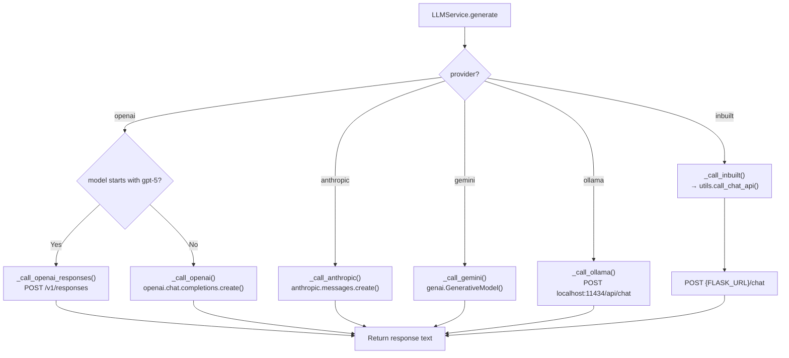

### LLM Service Methods

| Method | Purpose | Used By |
|--------|---------|---------|
| `generate(messages, provider, model)` | Main dispatch — routes to correct provider | All pipelines |
| `summarize(content, user_id, tenant_id)` | Summarize email thread | `/api/summarize` endpoint |
| `generate_reply(email_content, ...)` | Generate context-aware reply | `/api/generate-reply` endpoint |
| `analyze_sentiment(text)` | Sentiment analysis | `/api/analyze-sentiment` endpoint |

---

## 6. Inbuilt Mode — Zero-Config Path

For tenants without their own API keys, "inbuilt" mode uses centrally hosted services.

### Inbuilt Service Architecture

```
┌─────────────────────────────────────────────────────────────────────┐
│                        INBUILT MODE                                  │
│                                                                      │
│   ┌─────────────────┐          ┌─────────────────────────────┐      │
│   │ InbuiltLLMService│    →    │ utils.call_chat_api(prompt)  │      │
│   │ (inbuilt.py)     │         │    POST {FLASK_URL}/chat     │      │
│   └─────────────────┘          └──────────────┬──────────────┘      │
│                                                │                     │
│   ┌──────────────────────┐     ┌──────────────▼──────────────┐      │
│   │InbuiltEmbeddingService│ →  │ utils.call_embed_api(text)   │      │
│   │ (inbuilt.py)          │    │    POST {FLASK_URL}/embed    │      │
│   └──────────────────────┘     └──────────────┬──────────────┘      │
│                                                │                     │
│   ┌──────────────────────┐     ┌──────────────▼──────────────┐      │
│   │ InbuiltVectorClient  │  →  │ ChromaDBClient(inbuilt=True) │      │
│   │ (inbuilt.py)          │    │ Uses INBUILT_CHROMA_URL      │      │
│   └──────────────────────┘     └─────────────────────────────┘      │
│                                                                      │
│                     Central Flask Server                              │
│              ┌──────────────────────────────┐                        │
│              │   Flask + Ollama Wrapper      │                        │
│              │   /chat  → Ollama LLM         │                        │
│              │   /embed → Embedding model    │                        │
│              │                               │                        │
│              │   FLASK_URL (configurable)     │                        │
│              └──────────────────────────────┘                        │
└─────────────────────────────────────────────────────────────────────┘
```

### utils.py Function Reference

| Function | Endpoint | Purpose |
|----------|----------|---------|
| `call_chat_api(prompt)` | `POST {FLASK_URL}/chat` | LLM text generation via Flask/Ollama |
| `call_embed_api(text)` | `POST {FLASK_URL}/embed` | Embedding generation via Flask server |
| `ollama_generate_chat(prompt, model)` | `POST {OLLAMA_URL}/api/generate` | Direct Ollama access |
| `openai_generate_chat(prompt, comment)` | `POST api.openai.com/v1/responses` | OpenAI gpt-5-mini (Responses API) |

---

## 7. Embedding & Vector DB Flow

### Embedding Provider Routing

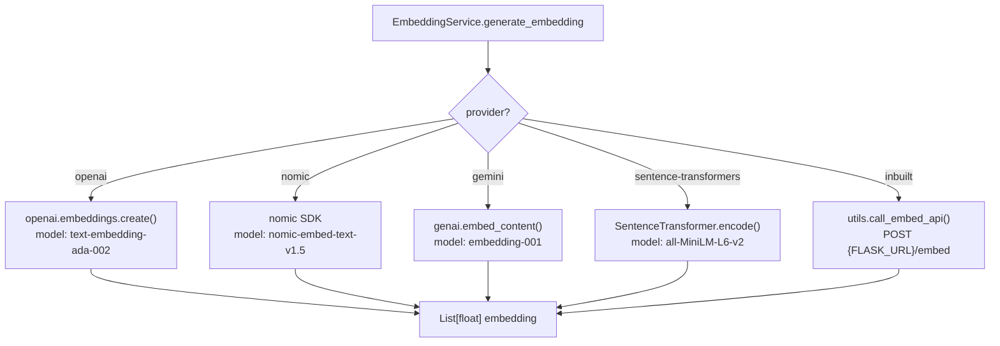

### Vector DB Factory

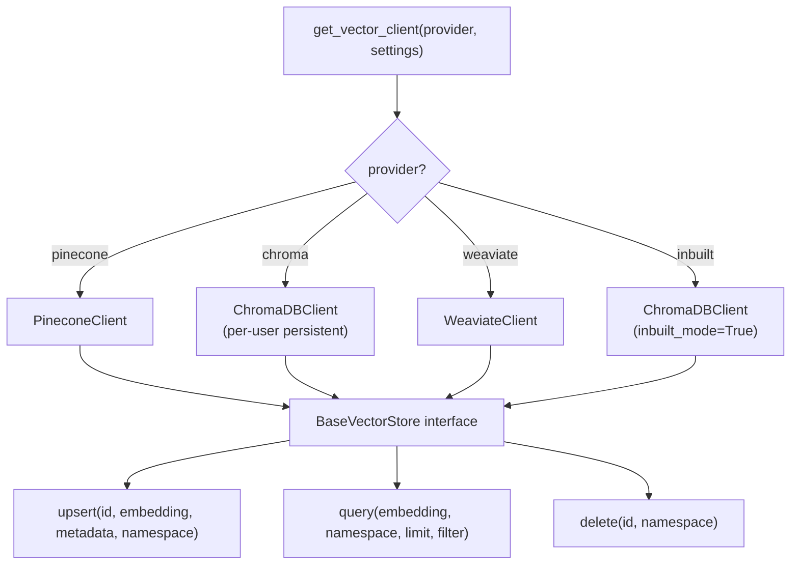

---

## 8. Data Flow Diagrams

### 8.1 Level 0 — Context Diagram

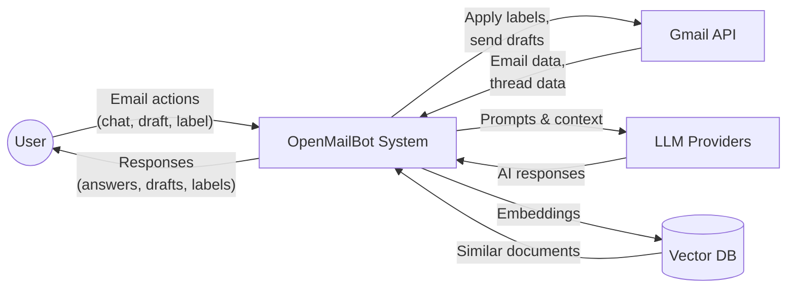

### 8.2 Level 1 — System Data Flow

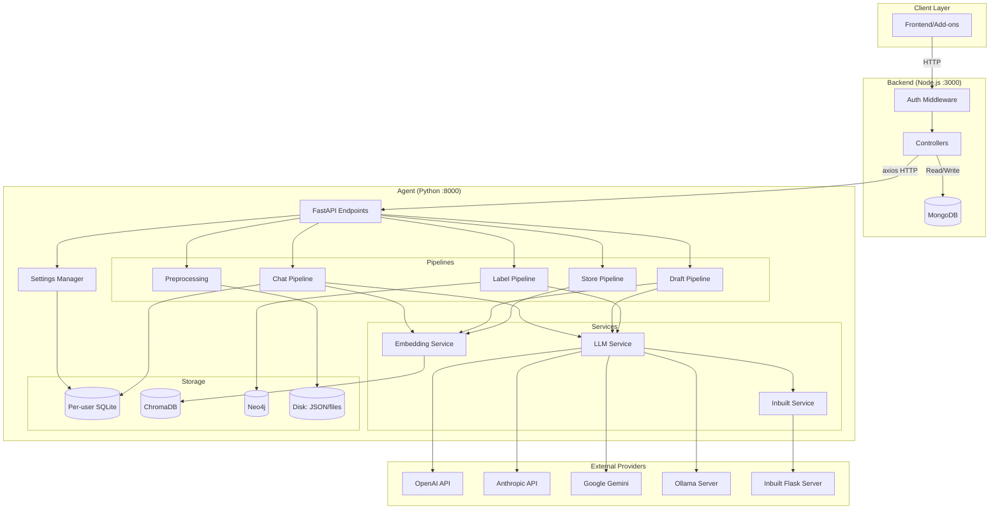

### 8.3 Level 2 — Chat Pipeline Data Flow

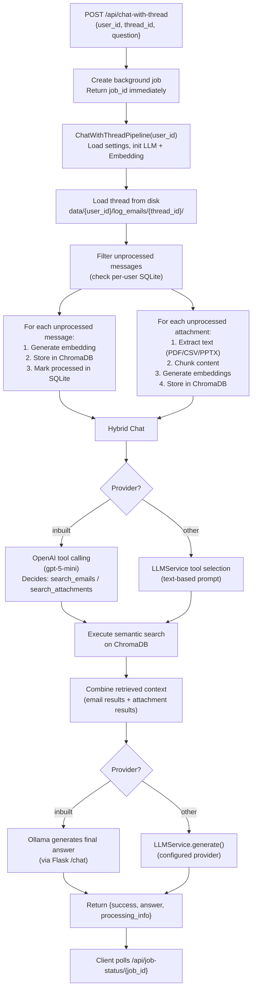

### 8.4 Level 2 — Label Pipeline Data Flow

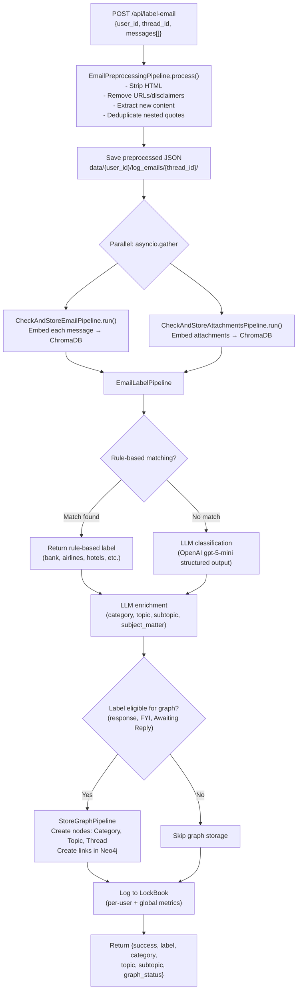

### 8.5 Level 2 — Draft Pipeline Data Flow

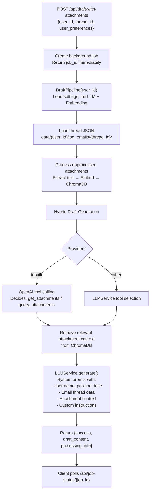

---

## 9. Activity Diagrams

### 9.1 User Chat Activity

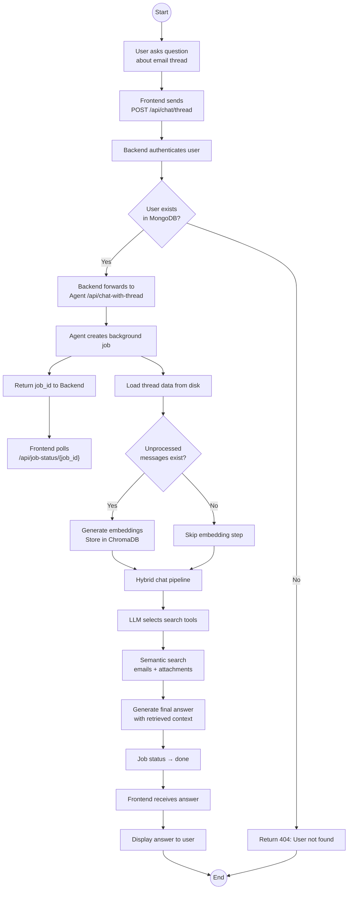

### 9.2 Email Labeling Activity

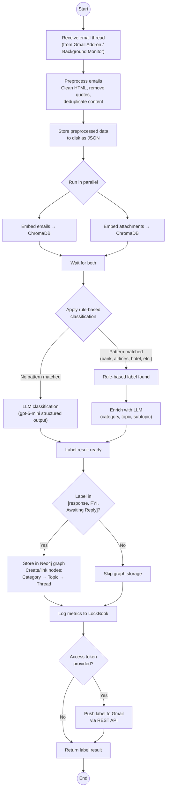

### 9.3 Draft Generation Activity

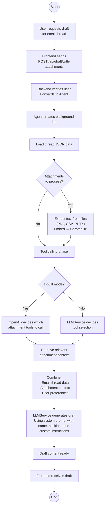

---

## 10. Process Flow Diagrams

### 10.1 End-to-End Email Processing Flow

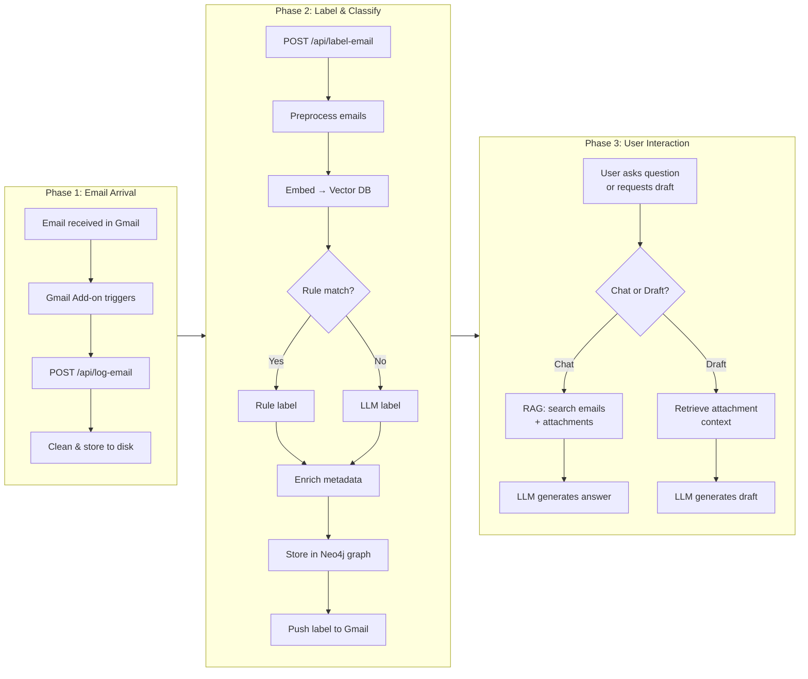

### 10.2 LLM Provider Selection Process

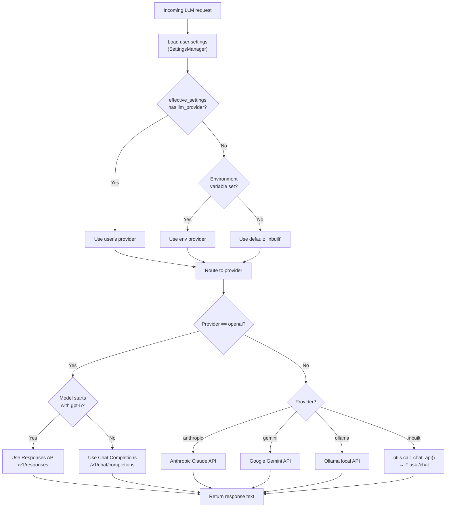

### 10.3 Vector Embedding & Storage Process

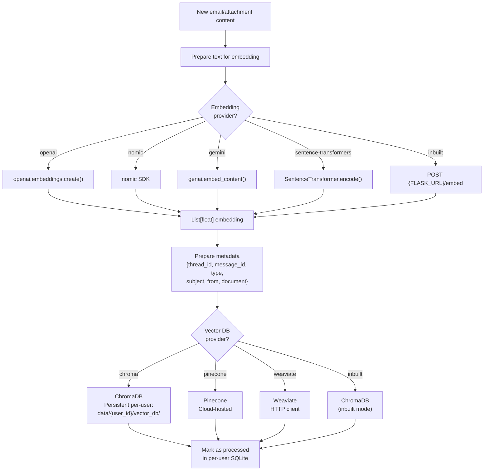

### 10.4 Background Job Lifecycle

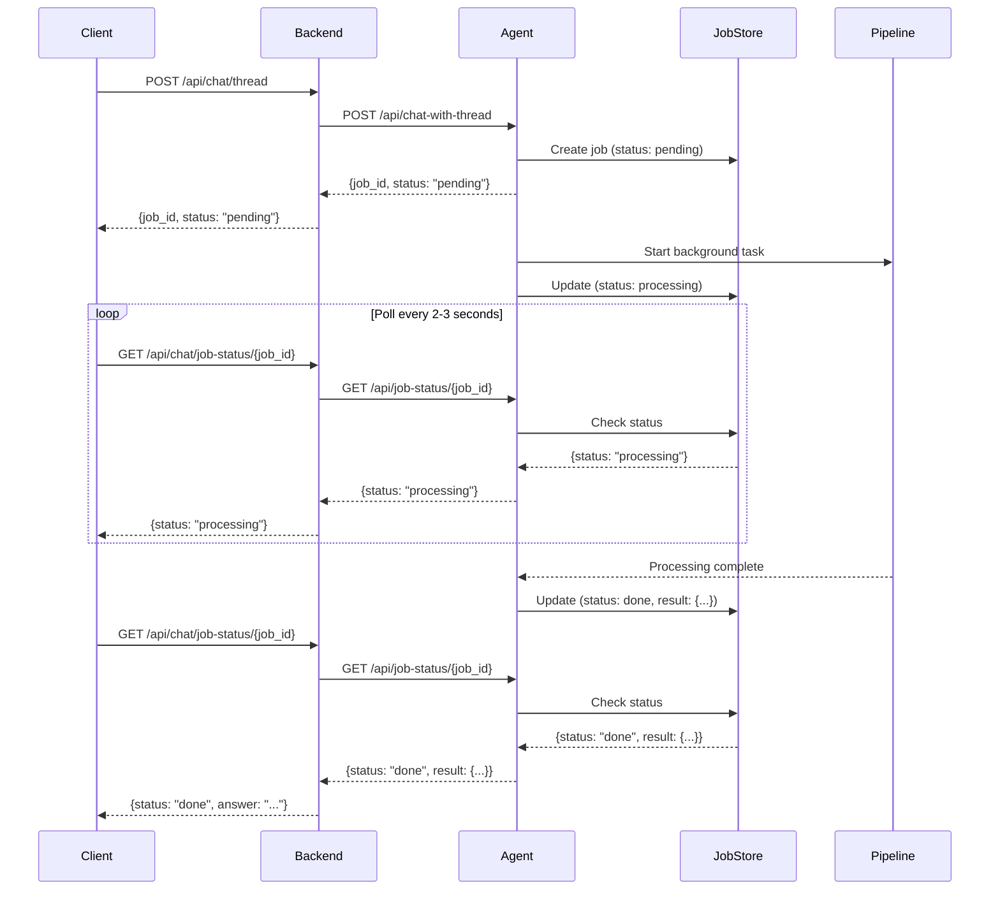

### 10.5 Hybrid Chat RAG Process (Detailed)

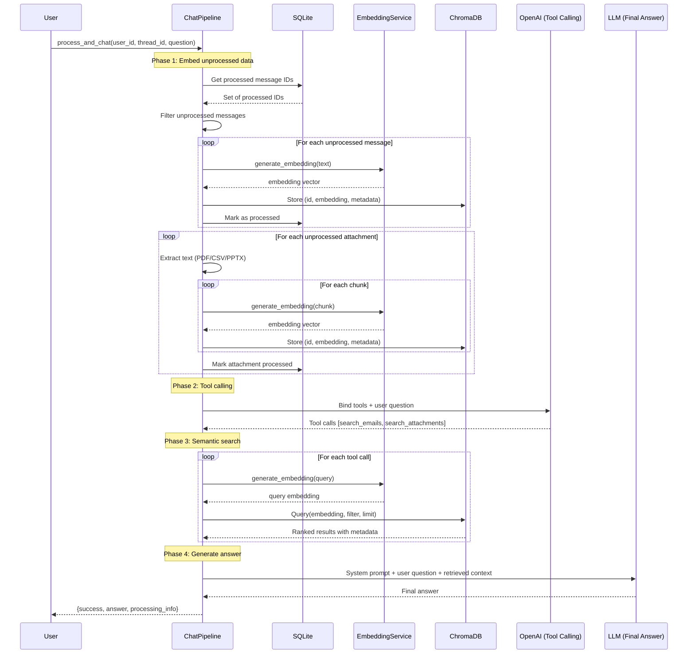

---

## 11. Data Objects Reference

### Request/Response Shapes

| Boundary | Direction | Shape |
|----------|-----------|-------|
| Frontend → Backend | Request | `{ user_id, thread_id, question }` |
| Backend → Agent | Request | `{ user_id, thread_id, question }` (enriched) |
| Agent → Pipeline | Internal | Pydantic: `ChatWithThreadRequest`, `LogEmailRequest`, `DraftWithAttachmentsRequest` |
| Pipeline → Preprocessing | Internal | `List[Dict]` of `{ message_id, from, to, subject, timestamp, body }` |
| Pipeline → EmbeddingService | Internal | `str` text → `List[float]` embedding |
| Pipeline → VectorDB | Internal | `{ vector_id, embedding, metadata, namespace }` |
| Pipeline → LLMService | Internal | `messages: [{ role, content }]` → `str` response |
| Agent → Backend | Response | `{ success, answer/label/draft_content, processing_info }` |
| Backend → Frontend | Response | Formatted JSON with success/error status |

### Email Message Structure (Internal)

```json
{
    "message_id": "msg_abc123",
    "from": "sender@example.com",
    "to": ["recipient@example.com"],
    "subject": "Meeting tomorrow",
    "timestamp": "2026-02-06T10:00:00Z",
    "body": "Clean text content after preprocessing"
}
```

### Vector DB Metadata (Email)

```json
{
    "thread_id": "thread_xyz",
    "message_id": "msg_abc123",
    "timestamp": "2026-02-06T10:00:00Z",
    "type": "email_data",
    "subject": "Meeting tomorrow",
    "from": "sender@example.com",
    "to": "recipient@example.com",
    "document": "Subject: Meeting tomorrow\n\nBody: Let's meet at 3pm..."
}
```

### Vector DB Metadata (Attachment)

```json
{
    "message_id": "msg_abc123",
    "thread_id": "thread_xyz",
    "attachment_id": "report.pdf",
    "filename": "report.pdf",
    "chunk_index": "0",
    "type": "attachment_data",
    "document": "Extracted text content from the attachment..."
}
```

### Label Pipeline Output

```json
{
    "label": "meeting",
    "category": "Discussion",
    "topic": "Team Meeting",
    "subtopic": "Sprint Planning",
    "subject_matter": "Weekly sprint planning meeting for Q1 deliverables"
}
```

---

## 12. Storage Architecture

### Per-User Data Directory Layout

```
agent/data/{user_id}/
├── log_emails/
│   └── {thread_id}/
│       └── {thread_id}.json          # Preprocessed email thread
│
├── store_attachments/
│   └── {thread_id}/
│       ├── report.pdf                 # Saved attachment files
│       └── {message_id}_metadata.json # Attachment metadata
│
├── vector_db/
│   └── cdb_{user_id}/
│       └── chroma.sqlite3            # Per-user ChromaDB persistent storage
│
└── sql_data/
    ├── chat_thread_processing.db     # Tracks: email_embeddings, attachment_processing
    └── draft_processing.db           # Tracks: draft_processing, attachment_processing
```

### Database Tables

**chat_thread_processing.db / draft_processing.db:**

| Table | Primary Key | Tracks |
|-------|-------------|--------|
| `email_embeddings` | `(user_id, thread_id, message_id)` | Which messages have been embedded |
| `attachment_processing` | `(user_id, thread_id, attachment_id)` | Which attachments have been embedded |
| `draft_processing` | `(user_id, thread_id, draft_id)` | Draft generation tracking |

**Settings DB (per-user, encrypted):**

| Table | Content |
|-------|---------|
| `user_settings` | Encrypted JSON with LLM provider, API keys, model preferences |

---

## 13. Observations & Notes

1. **Async Background Pattern:** Chat and draft endpoints return a `job_id` immediately. Clients poll `/api/job-status/{job_id}` until `status == "done"` or `"error"`. The in-memory `_job_store` dict is thread-safe via `threading.Lock`.

2. **Tool Calling is OpenAI-only for Inbuilt Mode:** Even when using "inbuilt" mode (Ollama for final answers), the tool-calling step uses OpenAI (`gpt-5-mini`) because Ollama doesn't natively support tool calling via the LangChain binding. For non-inbuilt providers, a text-based tool selection prompt is used instead.

3. **Dual Chat Pipeline Files:** Both `agent/chat_pipeline.py` (top-level) and `agent/services/chat_pipeline.py` exist. The **services/** version is the one actually imported and used by `main.py`.

4. **Some Endpoints are Disabled:** `ingest`, `related-threads`, and `slack/ingest` are commented out in `main.py`, indicating they are not yet production-ready.

5. **Hardcoded Paths:** `services/llm.py` and `services/embeddings.py` contain a hardcoded `CONFIG_PATH = "/home/ubuntu/openmailbot/openmailbot/agent/config.json"` which should be made relative.

6. **Label Push to Gmail:** The `/api/label-email` endpoint can optionally accept an `access_token` to push the classified label directly to the user's Gmail mailbox via the Gmail REST API, including color-coded label creation.

7. **Graph Storage is Selective:** Only threads labeled as `response`, `FYI`, or `Awaiting Reply` are stored in the Neo4j graph database. Other labels skip graph storage.

8. **Encryption:** User settings (including API keys) are encrypted at rest using PBKDF2-derived Fernet keys, scoped per user ID.
